# Milestone 1
The CameraController Visual Scripting Graph controls the motion of the camera. It monitors the Unity PlayerInput component. As the player presses certain buttons, the PlayerInput component sends a Unity event and passes it to the CameraController Graph. On the activation of the event, the CameraController Graph moves the MainCamera object. 

1. More specific details are added to the chart, and it now shows the flow of the interaction between objects and scripts. The logic of the auto-generation of maps is added; the player input logic is added; the unit control logic is added.
2. I used a finite state machine for the console, the public enum DebugMode. The player uses the console to toggle DebugMode between the state of On and Off. There are if() statements in the methods of multiple scripts. If the state of DebugMode is On, more detailed information will be printed by Debug.Log() as these methods are used, so that the developer (which is me) will be able to get the debug for further development when and only when needed. 

# Milestone 2
## Q1
I will need to build the features of movements of units. 
1. Add Map-to-world/world-to-map position calculator that can be used to assist input and visual output by converting between the world position that indicates the object's position on the screen and the map position that indicates the position on the hexigonal map on which all the data and game logic are based.
2. Build the unit data framework that indicates some basic properties and movement features of the unit.
3. Build the selection function, which includes:
    a. Mouse-click checker that uses the Map-to-world/world-to-map position calculator to check mouse click (if it is on UI, selectable objects or not, which type if it is)
    b. Selection manager that can trigger that realized the function of selecting/deselecting units (and potentially other objects going to be added)
    c. Selectable tag script that indicates that the object can trigger selection and indicates its type
4. Build the movement function, which includes:
    a. Direction finder that can find all surrounding tiles and their data given a Vector2DInt map position
    b. Path calculator that can calculate the shortest path from one point to another so that it can calculate all reachable tiles for a unit and the paths to reach them. 
    c. Update mouse-click checker.
    d. Add movement point cost property to tile data.
5. Build the movement animation framework, which includes:
    a. An animation manager that makes the unit moves through the pre-calculated path at a given speed.
    b. Make the animation manager allow using an animator for unit game object.
    c. Art assets for animation (if time permits)
6. Build the turn switching framework, which includes:
    a. Turn manager that allows the switching of turns to renew part of the game data
    b. Button object that allows the players to switch the turn witout having to toggle the console
    c. Same-screen multiplayer rotation framework
7. Add a testing initializer that asks the map generator to generates a random map of a proper size with a random seed and spawn the player on a random tile that is not a sea. It initializes the number of turns.
8. Bug fixations for the map generation system and the movement of the camera.
## Q2
It does not really help because I have never made games like this (and it was never taught). Therefore, I need to spend a lot of time exploring and trying the code structure myself. The very first breakdown that I came up with was too vague and general to be practical. The way that I will improve it is to make it exactly like the one that I wrote for Q1, which ic specific enough. 
## Q3
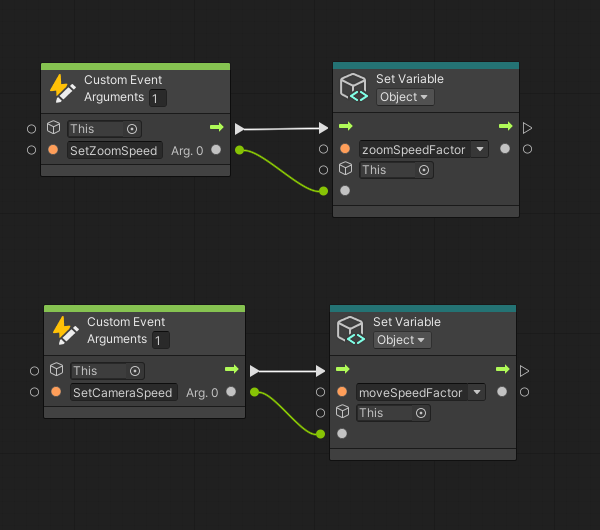
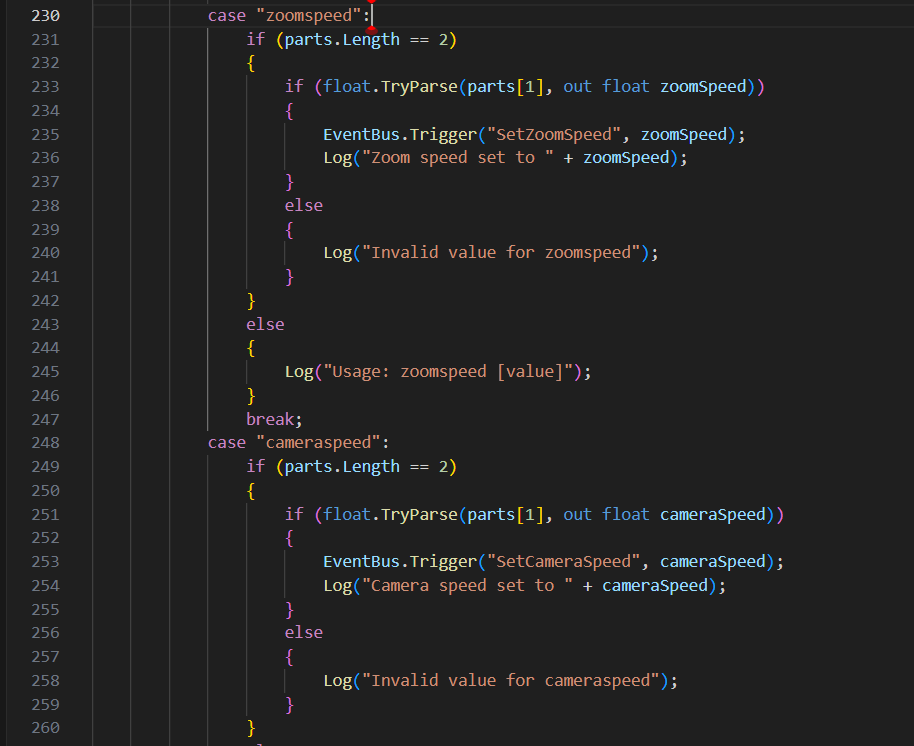
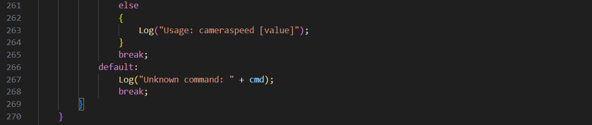
I used a custom event to trigger the event and pass the data from my code to my graph. The event trigger is in Console.cs, and the event is monitored by CamaraController. Its purpose is to make me able to set the movement speed and the zoom speed of the camera on the console. 
## Q4
The finite state machine. 
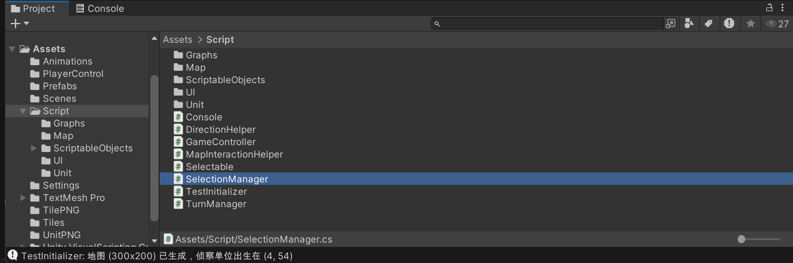
It is a state machine that indicates if something and what type of object (if true) is selected.
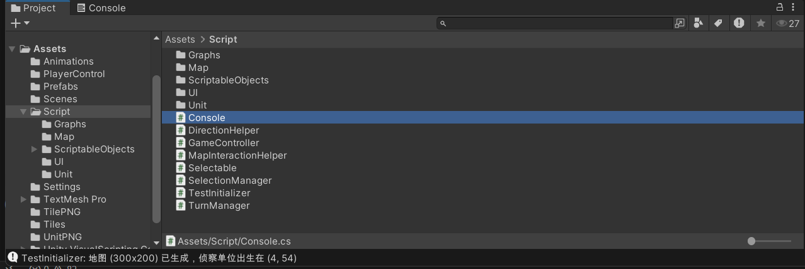
It is a state machine that controls the debug log. If it is on, more information will be logged.
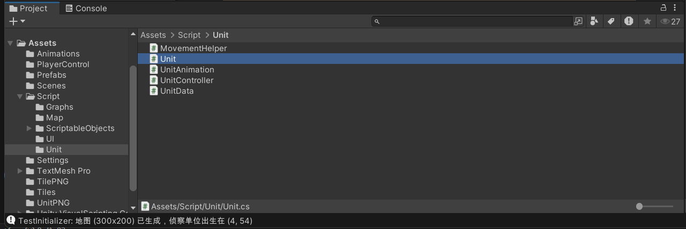
It is a state machine that indicates the what the unit is doing, which will be used to control the animation.

# Milestone 3
## Q1
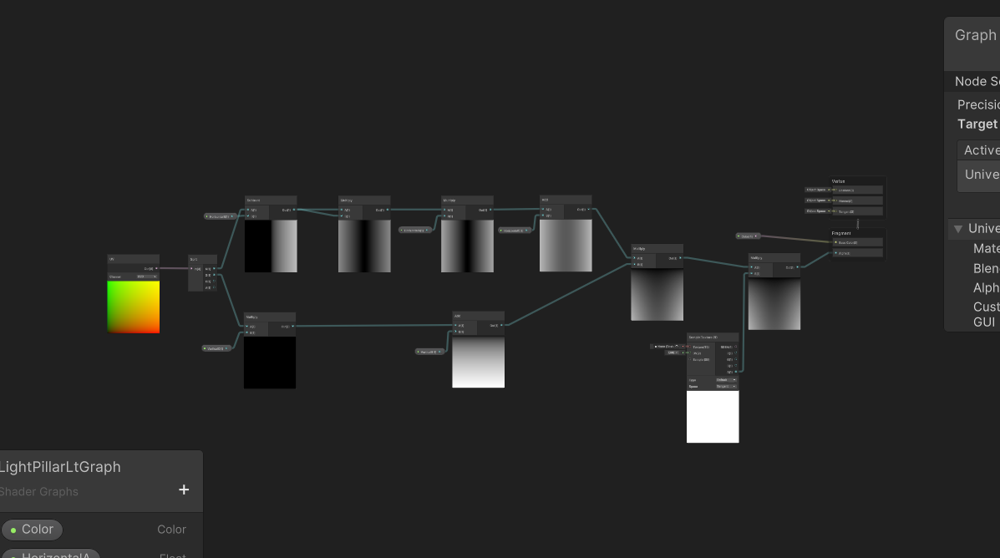
1. This shader graph is found in Assets -> Shaders -> LightPillarLtGraph; beside is the material using it (LightPillarLtMat). The LightPillarGraph in the same folder is not used, because it is too buggy. LightPillarLtMat is used on the LightPillar object on the object Assets -> Prefabs -> Scout.
2. I used a split node in the graph to split a UV to represent the horizontal and the vertical changes of the alpha value of the material respectively. Series of calculations are used to control the transparency. The horizontal change of the alpha value is f(R) = HorizontalA(R + HorizontalB)^2 + HorizontalC, which means that I can make the material more transparent in the middle and less on the edge (or vice versa) with a smooth transition, and I can change the intensity of change, the center of symmetry and the base value of alpha by operating these 3 properties respectively. The vertical change of the alpha value is f(G) = VerticalK * G + VerticalB, which means that I can make the material more transparent at the top and less at the bottom (or vice versa) with a smooth transition, and I can change the intensity of change and the position where the material becomes completely transparent by operating these 2 properties respectively. Its blending mode is addative, so that it makes the area it covers brigther, which makes it look more like a beam of light.
## Q2
1. I fixed the bugs that influenced the gameplay. Which includes: a. the movement range and the directions are not correctly calculated; b. the game collapses when the player tries to proceed to the next turn when the animation of the unit is still playing.
2. I added a light pillar (where a shader is used) to highlight the selected unit so that the player focus more on it (and therefore less likely to ignore the fact that he or she has selected something).
3. The player does not have to use the console to play the game anymore!
## Q3
1. I built the town framework so that the player can really own a developing town, which makes the game more complicated and closer to a game that provides a complete gameplay loop. It is part of the core mechanic of this game, and the center of the converting of the resources. The town now can gather resources and develop by itself and the player can do something with it. More functions to be added in the future. The player can click the town name on the panel and rename the town, which makes the game more immersive.
2. Like Civilization VI, he player now cannot proceed to the next turn when the required operations are not done: it prevents players from forgetting to operate the units and towns -- it is not useful yet at the current stage, but when the game become - hopefully - complicated enough, it can be a very useful function. 
3. Framework for more complicated terrains and landform built (assets not yet added). I built the framework to introduce more variety to the map so that the players will have more diverse options to do with the map, which will make the game more interesting. 

# Final Submission
## Q1
This is a vertical slice of a turn-based 4X game. The core game loop is eXplore, eXpand, eXploit and eXterminate: the player eXplores a randomly generated map, eXpands the settlements to eXploit the resources on from the map and utilize them to eXterminate other players. The first 3 of them are completed in the vertical slice, while the last being not yet illustrated. At the current stage, the game can automatically generate random maps; there is a fog of war system that hides the unknown parts of the world, a unit controlling system by which the player can move the units around, and a town management system that allows the player to manage, expand and utilize the towns.
1. In the current vertical slice, the player is spawned with a unit and the player can build even more. There is a fog of war system representing the unknown parts of the map. The player controls the units moving around the map to reveal these parts. This is the eXplore part of the game that includes an unknown world and a way to reveal the unknown world. 
2. The player is spawned with a town with one pop (unit of population). The size of population grows as food accumulates and new pops can be put on the tiles to claim the territory. This illustrates the eXpansion part of the game: the territory concequently gets larger and larger as the time passes.
3. There are so far 2 types of resources: food and materials. The player can put the new pops on the tiles to produce the resources. Resources can be used to generate new pops that produce resources, build buildings that convert resources and units that eXplore. This illustrates the eXploit part: the player gets and utilizes resources from the world.
## Q2
1. How the renderer effect is realized: The material of the sprite of the unit is replaced on selection and reset on deselection. When the player left-clicks on a unit, it is selected, and its material is replaced by one with flashy effect; when the player left-clicks elsewhere, it is deselected and its material is replaced by the default one. This is realized by the SelectVisual(GameObject obj) method and DeselectVisul(GameObject obj) method in SelectionManager.cs. As the selection/deselection happens, these two methods get the sprite renderer of the selected/deselected object, and set the material to be the given material or Sprites/Default. 
2. HOw the selection mechanic generally works: Selection and deselection is realized by a Selectable.cs: as the player clicks on the objects with this component (raycasting used), SelectionManager.cs tries to get Selectable component, if succeeds, the object is stored in GameObject currentSelected and passed to Select(GameObject newSelected), in which series of methods (including SelectVisual(GameObject obj)) are called, and Deselect() is called when fails, currentSelected it reset to default (if it is not null) and is set to null.
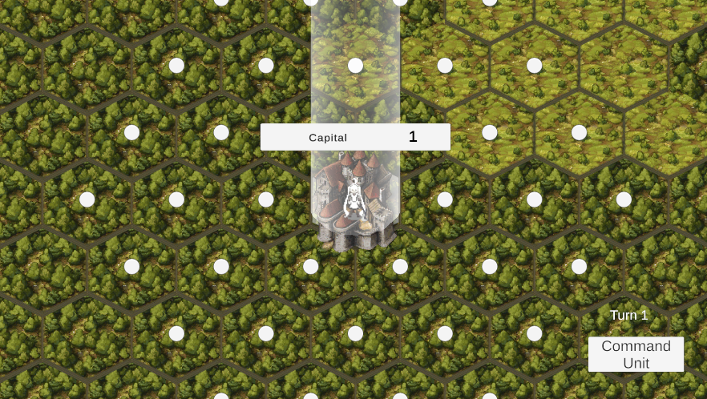
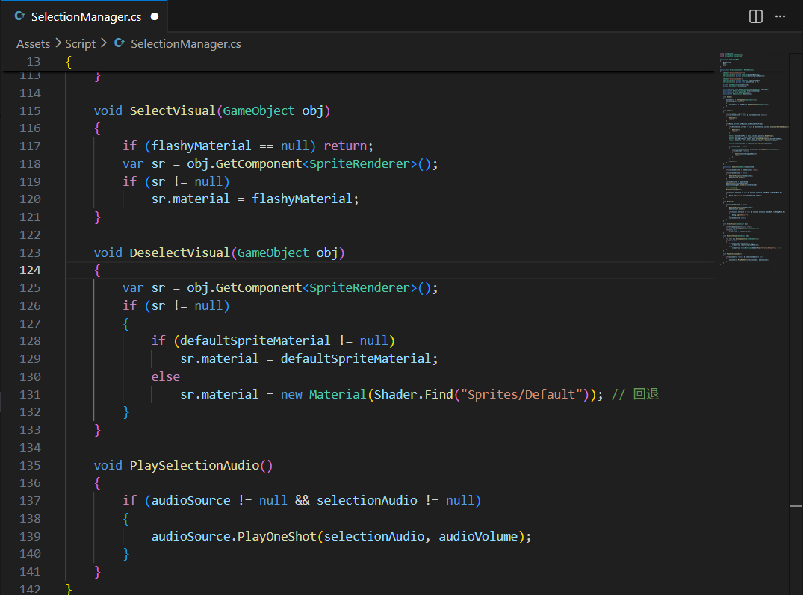
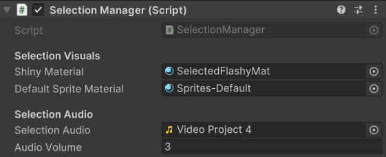
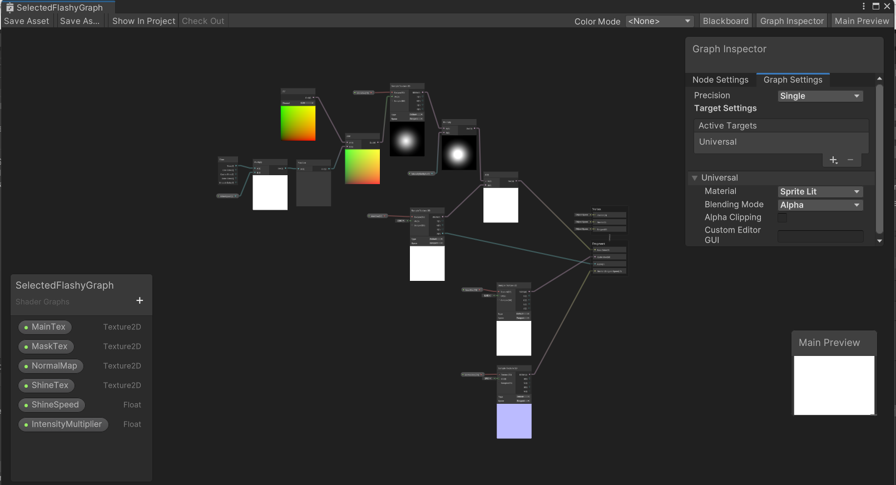
## Q3
Before a game is coded, the final experience must be imagined. Using the MDA framework, work backward from aesthetics to the required dynamics, then to specific mechanics. At this stage, technology is not a concern, but the intended feel of the game and what the player does repeatedly.

The experience is then decomposed into distinct gameplay loops. Each loop is an independently repeatable action cycle with clear inputs and outputs. Inputs are player actions or system triggers; outputs are game state changes and feedback. After all loops are mapped out, the requirements are frozen. No more new loops are added—to lock the scope.

For each gameplay loop, an MVC structure is used for technical breakdown. A loop is split into model, view, and controller. The model manages data and logical state. The view handles visual and audio presentation. The controller reads input and invokes the model. For each part, technical needs and asset needs are listed. Technical needs are functional points the code must deliver. Asset needs are the types of assets expected—sprites, like sprites, animations or audios. It does not yet has to be a full inventory, but specific types are clarified. At the low-level design stage, these three parts are kept strictly decoupled: changing the view does not affect the model, and altering input does not impact logic.

Once all loops are broken down, they are compared side by side. Shared technical needs and asset needs are extracted and merged. For example, identical movement logic used by multiple loops becomes a shared movement module. Common HUD elements, generic click sounds, and similar assets go into a unified list. After this deduplication, the total development effort becomes much clearer.

Technical needs are further decomposed into concrete classes and methods. Each class receives a defined responsibility. Each method lists its inputs, outputs, and internal technical approach. The approach may be as specific as raycasting or tilemap.maptoworldpos. Full pseudocode is unnecessary, but the description must be sufficiently explicit. Asset needs are now broken into a concrete list of asset files, with naming conventions, dimensions, frame counts, and other specifications. At this level of detail, no hidden unknowns remain.

Once everything is fully decomposed, coding and asset production begin in dependency order. This forms a complete action plan constructed before any implementation starts.

1. Yes, I do plan on using the bubble diagram. This is because it can help me estimate the direction and the amount of the work needed for all the planned features of the game. The bubble diagram illustrates a thinking process of viewing from general to specific, from whole to fractions. It breaks the planned features into specific classes and assets needed for their realization, series of small goals that I need to achieve; knowing them, I can estimate the time I will need and plan my time better. This is important in keeping the overall tasks on track, also preventing the over-scoping of the project. 
2. In many cases, I often underestimate the work needed for even some simpliest mechanics. These mechanics might seem as small as clicking to selection, which is completed in just a moment, but in fact incorporates the convertion between the world position and the map position, finite state machine, event, raycasting and/or other technical needs, which might also be shared with some other mechanics (like town expansion). Some of these might be the parts that I am not familiar with and need to learn. Concequently, I will need to put in far more efforts than I expected. Byy making a breakdown, I can have a clearer view on the work I will need to complete, realizing that some parts might be much more complicated than I expected (or sometimes vice versa) and therefore be able to know how large the scope will actually be. 
3. I did not fully follow the plan I described before, and the break down stopped at the stage of gameplay loop. This has caused the problem that I described in the earlier bullet point. It turned out that the stage at which I were did tell how the game will look like (if all the features are completed) but does not tell how much time and work I will need to put in it. Concequently, I was too ambitious at the very beginning of the project, and found that I could not realize all the features that I planned, so I had to delete some of them. It also resulted in some repetitive work, like the direction checker for the hexigonal map, and some classes that are never used, like LinearLandform.cs. In order to improve, I need to use a more reasonable workflow as I described before, in which more efforts on planning are put, breaking the gameplay loop into specific technical and asset needs, so that I will be able to know what to do (and what not to do) at first, having a more reasonable scope, and do what I need to do more efficiently. 